# StratsBites — Team Collaboration & Git Workflow Guide

Welcome, team! As your mentor, I have put together this guide to help your group of 4 collaborate smoothly, build consistently, and avoid code conflicts on GitHub while developing **StratsBites**.

Working in a team of 4 on a single codebase can be tricky, but by following this workflow, you will ensure a consistent build and a stress-free development process.

---

## 📅 The 5-Day Development Timeline

To ensure we build in the right order without blocking each other, we will use a **phase-based approach**:

```mermaid
gantt
    title StratsBites 5-Day Dev Timeline
    dateFormat  D
    axisFormat Day %d
    
    section Phase 1: Foundation
    Step 1 & 2 (Header & Layout)   :active, des1, 1, 1d
    
    section Phase 2: Parallel Dev
    Step 3 & 4 (HomePage)          : des2, 2, 2d
    Step 5 & 6 (MenuPage)          : des3, 2, 2d
    Step 7 (CheckoutPage UI)       : des4, 2, 2d
    
    section Phase 3: Integration
    Step 8 (CartContext State)     : des5, 4, 1d
    
    section Phase 4: Polish & Test
    Verify, debug & add images     : des6, 5, 1d
```



---

## 👥 Division of Labor

Here is the suggested role division mapped to the steps in the [Build Guide](STRATSBITES_BUILD_GUIDE.md).

### 👑 Member A: Team Lead & Git Coordinator
*   **Step 1: Header Component** (`src/components/Header.js`)
*   **Step 2: Layout Component** (`src/components/Layout.js`)
*   **Step 8: CartContext** (`src/context/CartContext.js` and wrapping `main.jsx`)
*   **Responsibilities:**
    *   Initialize the setup and push the foundation branch.
    *   Review and merge Pull Requests (PRs) from other members.
    *   Help resolve merge conflicts.

### 🏠 Member B: Home Page Developer
*   **Step 3: HomePage** (`src/pages/HomePage.js`)
*   **Step 4: CafeteriaCard Component** (`src/components/CafeteriaCard.js`)
*   **Responsibilities:**
    *   Implement the main page layout, search bar visual, and cafeteria cards.
    *   Fetch and map the cafeteria list from `data.json`.

### 🍔 Member C: Menu Page Developer
*   **Step 5: CafeteriaMenuPage** (`src/pages/CafeteriaMenuPage.js`)
*   **Step 6: MenuItem Component** (`src/components/MenuItem.js`)
*   **Responsibilities:**
    *   Implement the menu page, extract the cafeteria ID using `useParams`, and render menu items.
    *   Display items grouped by category or list them cleanly.

### 🛒 Member D: Checkout Page Developer
*   **Step 7: CheckoutPage UI** (`src/pages/CheckoutPage.js`)
*   **QA & Asset Manager:**
    *   Responsible for gathering cafeteria food images, saving them in `public/images/`, and linking them in `data.json`.
    *   Coordinates manual testing across different pages.
    *   Assists Member A with wiring the Checkout UI to the Cart Context in Step 8.

---

## 🐙 Git & GitHub Collaboration Workflow

To prevent team members from overwriting each other's code, **never commit directly to the `main` branch**. Follow these steps:

### 1. Initial Setup (First Time Only)
The project owner must invite all 3 members as **collaborators** on the GitHub repository settings.
Once invited, all team members should clone the repository to their computers:

```bash
# Clone the repository
git clone https://github.com/nyongesakennedy06-afk/Web_dev_project.git

# Navigate into the project folder
cd Web_dev_project

# Install dependencies (react-router-dom, etc.)
npm install
```

---

### 2. Creating a Feature Branch
Before writing any code, make sure your local copy is up to date, and create a new **feature branch** named after your task:

```bash
# 1. Switch to main branch
git checkout main

# 2. Pull the latest code from GitHub
git pull origin main

# 3. Create and switch to your feature branch (use descriptive names)
git checkout -b feature/homepage-cards
```

> [!IMPORTANT]
> **Rule:** One branch per feature. Never edit files belonging to other steps unless coordinated!

---

### 3. Writing Code and Committing
As you make progress, commit your work with descriptive messages:

```bash
# Check which files you changed
git status

# Add your changes
git add src/pages/HomePage.js src/components/CafeteriaCard.js

# Commit with a clear, professional message
git commit -m "feat: build HomePage grid and CafeteriaCard skeleton"
```

---

### 4. Pushing and Creating a Pull Request (PR)
When your feature is complete and runs locally with no errors (`npm run dev` works perfectly), push it to GitHub:

```bash
# Push your branch to GitHub
git push origin feature/homepage-cards
```

Once pushed:
1. Go to the GitHub repository online.
2. Click **Compare & pull request**.
3. Add a description of what you did.
4. Assign **Member A (Team Lead)** as the reviewer.
5. Wait for review and approval before merging.

---

### 5. Keeping Your Branch Up to Date
If Member A merges another feature branch into `main` while you are still working, your branch will be outdated. To pull their changes into your branch:

```bash
# Commit or stash your current work first, then:
git checkout main
git pull origin main
git checkout feature/homepage-cards
git merge main
```
*If there are merge conflicts, VS Code will highlight them. Discuss with your team lead to resolve them together.*

---

## 🎨 Best Practices for Code Consistency

To make sure the project feels like it was written by **one person** instead of four, adhere to these guidelines:

### 1. Component Structure
All components must use **Arrow Function Syntax** with the component name matching the file name:

```javascript
import React from 'react';

const CafeteriaCard = ({ cafeteria }) => {
  return (
    <div className="cafeteria-card">
      {/* JSX code goes here */}
    </div>
  );
};

export default CafeteriaCard;
```

### 2. Chronological Styles in `src/App.css`
To keep the single stylesheet `src/App.css` clean, the file has been divided into commented sections. Only write your styles within your assigned section:

*   `/* SECTION 1: HEADER & LAYOUT */` → Member A
*   `/* SECTION 2: HOME PAGE & CARDS */` → Member B
*   `/* SECTION 3: MENU PAGE & ITEMS */` → Member C
*   `/* SECTION 4: CHECKOUT PAGE */` → Member D

### 3. Absolute Consistency with `data.json`
Do not change keys in `src/data/data.json` without notifying the group. Always reference fields exactly as they are defined:
*   Use `cafeteria.id`, `cafeteria.name`, `cafeteria.deliveryTime`.
*   Use `item.price`, `item.name`, `item.description`.

---

## 🚀 How to Resolve Merge Conflicts

If you and a classmate edit the same line of the same file, Git won't know which one to keep. This is a merge conflict. Don't panic!

1. Open the conflicting file in VS Code.
2. You will see markers:
   *   `<<<<<<< HEAD (Current Change)`: Your local code.
   *   `=======`: Separator.
   *   `>>>>>>> main (Incoming Change)`: Code already on GitHub.
3. Talk to the person who wrote the incoming change. Decide which code to keep or how to combine them.
4. Delete the markers (`<<<<<<<`, `=======`, `>>>>>>>`), save the file.
5. Add, commit, and push:
   ```bash
   git add <filename>
   git commit -m "chore: resolve merge conflict"
   git push origin feature/<branch-name>
   ```

Happy coding! Let's build a beautiful campus app. 🎓🍔
